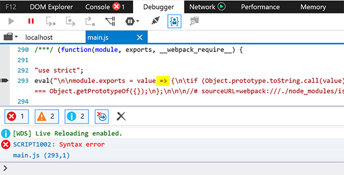
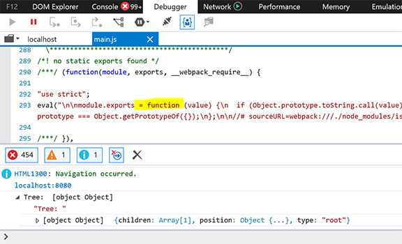

## Using unified in Internet Explorer

> This guide assumes you already know the basic concepts of
> [unified][using-unified].

This guide shows how to make unified available in IE through the
[webpack bundler][webpack] and [babel compiler][babel] in a minimal unified
project.  If you are using unified in a large project, you may already
integrate the [polyfill][polyfill] to support IE.

> IE is different from other evergreen browsers because it doesn’t support
> [ES2016][] syntax.  For Windows, the story is different because it’s the
> builtin javascript engine for some on-premise applications.
> To meet the need of this engine, all [ES2016][] code must be compiled
> to [ES2015][].

### Contents

*   [Creating minimal unified project](#creating-minimal-unified-project)
*   [Creating webpack config](#creating-webpack-config)

### Creating minimal unified project

The following script will create a minimal unified project from scratch.

```bash
#!/bin/bash
mkdir unified-project
cd unified-project

mkdir src
cat > index.html <<EOF
<script src="main.js"></script>
EOF
cat > src/index.js <<EOF
import unified from "unified"
import markdown from "remark-parse"
const tree = unified().use(markdown).parse("# Heading1")
console.log("Tree: ", tree)
EOF
npm init -y
npm install --save unified remark-parse
npm install --save-dev webpack webpack-cli webpack-dev-server
```

Run the project with `webpack-dev-server` after `cd unified-project`

```bash
./node_modules/.bin/webpack-dev-server --mode development
```

Now we can open chrome and navigate to `http://localhost:8080` .  We’ll see
the expected output from console.


But if we open with IE, a syntax error will be raised from `is-plain-obj`
package, we need to transpile this incompatible package later.



### Creating webpack config

Now we can create a `webpack.config.js` besides our `index.html`.  The
following script tells webpack to transpile the `is-plain-obj` package with
`babel-loader` before bundling it in `main.js`.

> Note: we are using the default values for other common webpack configs.  Like
> `/src/index.js` as entry point and `/index.html` as home page.

```bash
#!/bin/bash
cat > webpack.config.js <<EOF
module.exports = (env, options) => ({
  module: {
    rules: [
      {
        test: /node\_modules\/.*is\-plain\-obj\/.*\.js$/,
        use: {
          loader: "babel-loader",
          options: { presets: ["@babel/preset-env"] },
        },
      },
    ],
  },
})
EOF
npm install --save-dev babel-loader @babel/preset-env @babel/core
```

Again, start the server

```bash
./node_modules/.bin/webpack-dev-server --mode development
```

Now the IE can load unified correctly.



<!--Definitions-->

[using-unified]: /using-unified.html

[webpack]: https://webpack.js.org/

[babel]: https://babeljs.io/

[polyfill]: https://babeljs.io/docs/en/babel-polyfill

[es2016]: https://en.wikipedia.org/wiki/ECMAScript

[es2015]: https://en.wikipedia.org/wiki/ECMAScript
